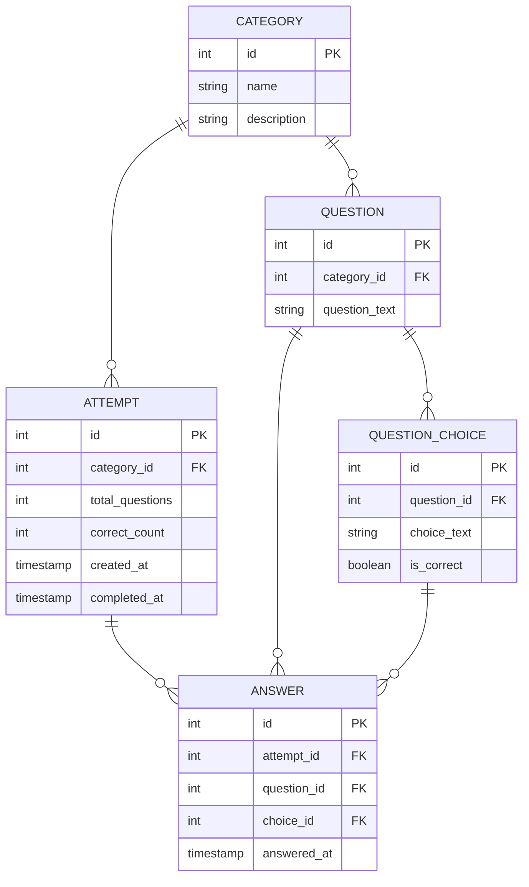

# クイズアプリケーション 仕様書

## 1. 概要

カテゴリー単位でクイズに挑戦し、回答履歴を管理するシステム。

## 2. 主要概念

### 2.1 カテゴリー
- クイズ問題のまとまり
- 複数の問題を保持

### 2.2 挑戦
- 1つのカテゴリーに対して行う1回のクイズ挑戦

### 2.3 問題
- 選択式問題（複数の選択肢を持つ）
- カテゴリーに属する
- 選択肢の中に1つの正解を含む

### 2.4 回答
- 問題に対して送信する選択肢
- 問題ごとに回答履歴として保存

### 2.5 挑戦結果
- 1回の挑戦全体の集計結果

## 3. ユースケース

### 3.1 クイズ挑戦開始
```
1. カテゴリーを選択
2. 挑戦を開始
```

### 3.2 問題出題と回答
```
1. 問題を表示（選択肢を含む）
2. 選択肢を選び、回答を送信
3. 正誤判定を確認し次の問題へ
4. すべての問題に回答するまで1〜3を繰り返す
```

### 3.3 挑戦完了
```
1. すべての問題に回答後、挑戦を完了
2. 挑戦結果（統計情報）を確認
```

### 3.4 過去の挑戦一覧を参照
```
すべての挑戦履歴を取得
```

### 3.5 挑戦の詳細を参照
```
特定の挑戦の全問題の回答履歴・正誤を取得
```

## 4. 機能一覧

| # | 機能 | 説明 |
|---|------|------|
| 1 | カテゴリー一覧取得 | 利用可能なカテゴリーを取得 |
| 2 | 挑戦開始 | カテゴリーを指定して挑戦を作成 |
| 3 | 次の問題取得 | 指定された挑戦内で未回答の問題を取得 |
| 4 | 回答送信 | 問題に対する回答を送信し、結果を保存 |
| 6 | 挑戦結果取得 | 指定された挑戦の結果（統計情報）を取得 |
| 7 | 回答履歴取得 | 指定された挑戦のすべての回答履歴を取得 |

## 5. データモデル

### 5.1 エンティティ関連図



### 5.2 主要カラム説明

**CATEGORY**
- `id`: カテゴリーの一意識別子
- `name`: カテゴリー名

**QUESTION**
- `id`: 問題の一意識別子
- `category_id`: 所属するカテゴリー
- `question_text`: 問題文

**QUESTION_CHOICE**
- `id`: 選択肢の一意識別子
- `question_id`: 所属する問題
- `choice_text`: 選択肢テキスト
- `is_correct`: 正解かどうか（true = 正解、false = 不正解）

**ATTEMPT**
- `id`: 挑戦の一意識別子（自動採番）
- `category_id`: 挑戦するカテゴリー
- `total_questions`: 出題問題数
- `correct_count`: 正解数
- `created_at`: 挑戦開始時刻
- `completed_at`: 挑戦完了時刻（null = 進行中、値あり = 完了）

**ANSWER**
- `id`: 回答の一意識別子
- `attempt_id`: 所属する挑戦
- `question_id`: 回答した問題
- `choice_id`: ユーザーが選んだ選択肢
- `answered_at`: 回答時刻


## 6. API仕様（概要）

### 6.1 RESTエンドポイント

```
GET    /api/categories                      # カテゴリー一覧取得
POST   /api/attempts                        # 挑戦開始
GET    /api/attempts/{attempt_id}/question  # 次の問題取得
POST   /api/attempts/{attempt_id}/answer    # 回答送信
GET    /api/attempts                        # 挑戦結果一覧取得
GET    /api/attempts/{attempt_id}           # 特定の挑戦結果取得
GET    /api/attempts/{attempt_id}/answers   # 特定の挑戦の回答履歴取得
```

## 7. ビジネスロジック

### 7.1 次の問題取得
- 指定された挑戦内で、まだ回答していない問題をランダムに1問選択
- 同じ挑戦内では同じ問題を出題しない

### 7.2 正誤判定
- ユーザーの選択肢が正解かどうかを判定

### 7.3 挑戦完了判定
- すべての問題に回答したかをチェック

### 7.4 合否判定
- 挑戦結果に基づき、合格・不合格を判定
- 合格基準は50%以上の正解率

### 7.5 経過時間計算
- 挑戦開始から完了までの経過時間を計算

